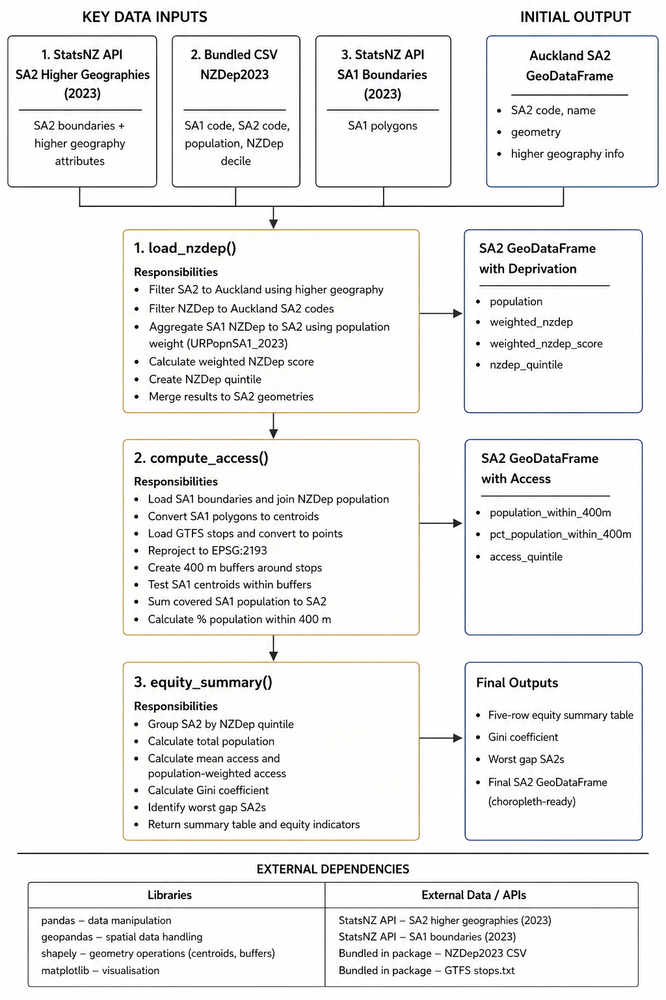

## Solving the problem

Auckland currently faces a transport equity challenge. Public transport access is not only about whether the city has a large transport network, but whether that access is fairly distributed across different communities. Auckland Transport defines transport equity as the fair distribution of the transport system’s positive and negative impacts across social groups and geographic areas [@aucklandtransport_equity_framework]. This matters because transport access affects people’s ability to reach work, education, healthcare, and other essential services. Existing Auckland transport equity work highlights that access to transport affects people’s wellbeing and that equity is important for transport policy and investment [@mot_auckland_transport_equity].

This issue is especially important for high-deprivation neighbourhoods because Auckland Transport identifies areas where poor transport outcomes overlap with socio-economic deprivation as a key concern. The Equity Framework also notes that some high-deprivation areas are distant from, or not well connected by, public transport and active transport to major employment areas and essential services [@aucklandtransport_equity_framework].

However, there is a workflow gap. The data needed to investigate this issue already exists, including SA2 and SA1 boundaries, NZDep2023 deprivation data, SA1 population data, and GTFS public transport stop locations. Tools such as ArcGIS Pro and QGIS can perform the individual spatial operations, but the workflow is fragmented. A user must manually aggregate NZDep data from SA1 to SA2, create public transport stop buffers, estimate population access, join the results to SA2 boundaries, and summarise access by deprivation quintile. These repeated steps make the analysis time-consuming and difficult to reproduce consistently. The gap is therefore not the absence of GIS tools, but the lack of a simple workflow that brings these datasets together for SA2-level public transport equity analysis.

## Who will use it, and why?

This package is designed for transport planners, GIS researchers and policy analysts who want to evaluate whether public transport access is distributed fairly across Auckland neighbourhoods. 

It allows users to identify neighbourhoods where residents experience both high deprivation and low public transport access. Users can generate deprivation quintile summaries, compute inequality metrics such as the Gini coefficient, and create choropleth maps highlighting transport disadvantage hotspots.

A concrete use case is an Auckland Council transport planner evaluating whether future bus service investment should prioritise South Auckland neighbourhoods. Using this package, the planner can quantify whether the most deprived quintiles have a lower percentage of residents within 400 m of a public transport stop than less deprived areas, and identify the specific SA2s with the largest accessibility gaps.

## Key functions

Our group plans to develop the compute_access(), load_nzdep(SA2_gdf), and equity_summary(gdf) functions.

load_nzdep(sa2_gdf) is responsible for preparing the deprivation component of the analysis. It aggregates SA1 level NZDep2023 and population data to SA2 level using URPopnSA1_2023 as a population weight, then joins the result to the SA2 GeoDataFrame. The rationale for this function is that transport equity cannot be evaluated using accessibility data alone.

compute_access() is the core spatial-analysis component of the package and directly connects GIS processing with transport equity analysis. This function calculates public transport accessibility for each SA2 using GTFS stop data and a 400 m buffer-based access model. Accessibility measurement forms the foundation of the entire project. Without a reliable access metric, equity comparisons cannot be made.

equity_summary(gdf) produces the final equity metrics and summary outputs. As raw accessibility values are difficult to interpret without a clear equity framework, we need this function to turn spatial data into interpretable evidence about transport inequality, and help identify neighbourhoods experiencing the largest accessibility gaps.

## Technical architecture

### Pipeline diagram

{#fig-pipeline width=70% fig-pos="H"}

### Core function responsibilities and key data inputs/outputs

The package is structured around three main functions: `load_nzdep()`, `compute_access()`, and `equity_summary()` because it separates the workflow into separate responsibilities: deprivation preparation, access calculation, and equity summarisation. Keeping these stages separate makes the package easier to test, debug, and extend. These functions follow a simple data pipeline where an SA2 GeoDataFrame is progressively enriched with deprivation data, public transport access metrics, and final equity indicators. @fig-pipeline shows how the input datasets move through these three functions to produce the final SA2-level outputs.

The first key function, load_nzdep(), uses the SA2 higher geographies GeoPackage as the main spatial layer loaded from the Stats NZ Datafinder API. This dataset is used instead of a plain SA2 boundary file because it contains SA2 geometries as well as higher geography information, which allows the package to filter the national dataset to Auckland. The NZDep2023 CSV bundled in the package is then filtered to the Auckland SA2 codes. Because NZDep2023 is provided at SA1 level, the function aggregates the data to SA2 level using URPopnSA1_2023 as the population weight. This avoids treating small and large SA1 areas equally. The output is an Auckland SA2 GeoDataFrame containing population, weighted deprivation, and NZDep quintile.

The second key function, compute_access(), estimates stop-based public transport access. GTFS stops.txt is bundled within the package. It is used because it provides the latitude and longitude of public transport stops. These stops are converted into point geometries and reprojected to EPSG:2193 so that distances can be measured in metres. The package then creates 400 m buffers around stops. Although the NZDep2023 CSV already provides SA1 population and the corresponding SA2 code, SA1 boundary data is still required to be loaded from the Stats NZ Datafinder API for the access calculation because it provides the geometry needed to calculate SA1 centroids. These centroids are used as representative population points and tested against 400 m public transport stop buffers. Covered SA1 populations are summed to SA2 level, producing the percentage of each SA2’s population within 400 m of a public transport stop.

The third key function, equity_summary(), compares access across deprivation groups. It groups SA2s by NZDep quintile and calculates a five-row table showing population, access, and population-weighted access for each deprivation quintile. It also calculates a Gini coefficient to summarise overall inequality in access. Finally, it identifies “worst gap” areas, which are SA2s with high deprivation and low relative access. Using this data, the final outputs are an Auckland SA2 GeoDataFrame, a NZDep quintile choropleth, a public transport access choropleth, a worst-gaps map, a five-row equity summary table, and a Gini coefficient.

### External dependencies
The main external dependencies are `pandas` for CSV processing, `geopandas` for spatial data handling, `shapely` for geometry operations such as centroids and buffers, and `matplotlib` for visualisation. The key external datasets are the SA2 higher geographies boundary file and SA1 boundary file fetched from the Stats NZ Datafinder API, the NZDep2023 CSV, and GTFS public transport stop data.

The package uses NZDep2023 as the deprivation input because it is a small-area measure of socioeconomic deprivation produced from census variables [@otago_nzdep2023]. The SA2 higher geographies layer is used because it provides SA2 boundaries concorded to higher geographies, allowing Auckland SA2s to be filtered from the national layer [@statsnz_sa2_higher_geographies_2023]. The SA1 boundary layer is used because it provides the SA1 geometries needed to calculate representative population centroids for the 400 m stop-buffer access test [@statsnz_sa1_2023]. GTFS is used because it provides a standard format for public transport schedule and geographic information, including stop locations [@at_gtfs].

### Design tradeoff
The main design trade-off is the use of a 400 m buffer instead of full walking-network distance for the public transport stops. A network-based method would better represent real walking routes, but it would introduce more complex processing, additional road network data, and longer computation time. Another trade-off is using SA1 centroids as representative population points. This is more accurate than using a single SA2 centroid, but it still assumes that the SA1 population is represented by its centroid. Therefore, the package measures stop-based proximity to public transport, not full public transport quality. It does not measure service frequency, travel time, route usefulness, or reliability.

## Summary
Equitransport overall provides a simpler solution for SA2 level public transport equity analysis. It automates a workflow that could be completed manually in GIS software, but makes the process more reproducible and more adaptable. Its modular structure means that future versions could replace or extend individual components, such as using different public transport datasets, network based walking distances, or deprivation measures from other cities and countries.

## References